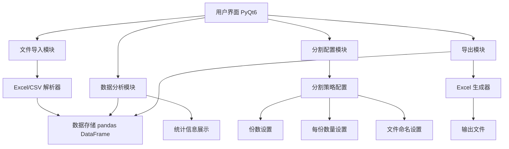

# 线索池数据分割工具 - 项目设计文档

## 1. 系统架构

## 2. 功能模块

### 2.1 文件导入
- 支持 Excel (.xlsx, .xls) 和 CSV 格式
- 自动识别列头
- 数据预览功能

### 2.2 数据分析
- 统计总行数
- 统计 wm_poi_id 数量
- 显示数据预览

### 2.3 分割配置
- 设置分割份数（动态生成配置项）
- 每份数量设置
- 自定义输出文件名
- 实时校验总数是否匹配

### 2.4 数据导出
- 按配置分割数据
- 输出字段映射：
  - wm_poi_id → 商家门店id
  - provider_id → 服务商id（留空）
- 进度条显示导出进度

## 3. 数据字段映射

| 原始字段 | 输出字段 | 说明 |
|---------|---------|------|
| wm_poi_id | 商家门店id | 直接映射 |
| provider_id | 服务商id | 输出时留空 |

## 4. UI 设计规范

### 4.1 配色方案
- 主色调: #409EFF (蓝色)
- 成功色: #67C23A
- 警告色: #E6A23C
- 危险色: #F56C6C
- 背景色: #F5F7FA
- 卡片背景: #FFFFFF

### 4.2 布局规范
- 窗口尺寸: 800 x 600
- 内边距: 20px
- 卡片圆角: 8px
- 元素间距: 16px

### 4.3 字体规范
- 标题: 16px, Bold
- 正文: 14px, Regular
- 辅助文字: 12px, #909399

## 5. 技术栈

- Python 3.9+
- PyQt6 (GUI框架)
- pandas (数据处理)
- openpyxl (Excel读写)
